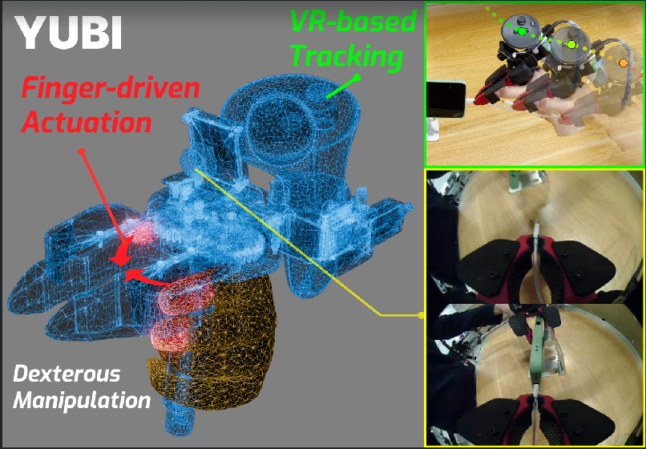
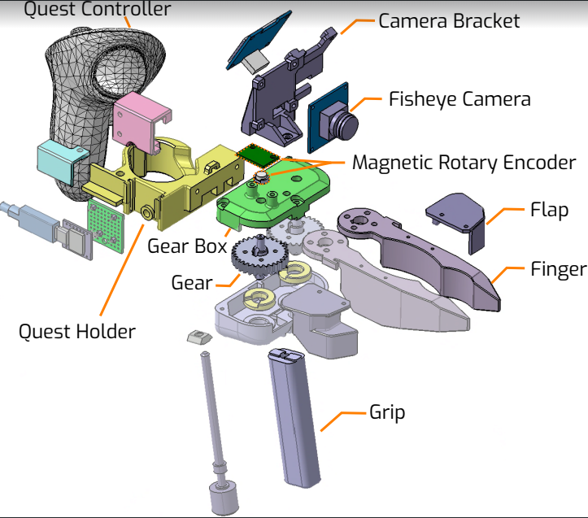
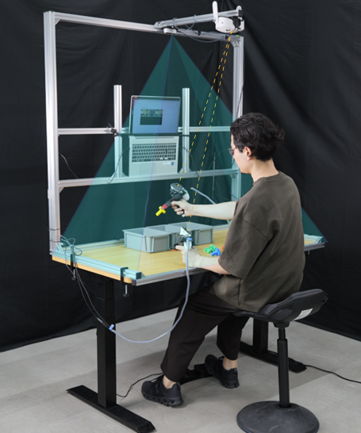
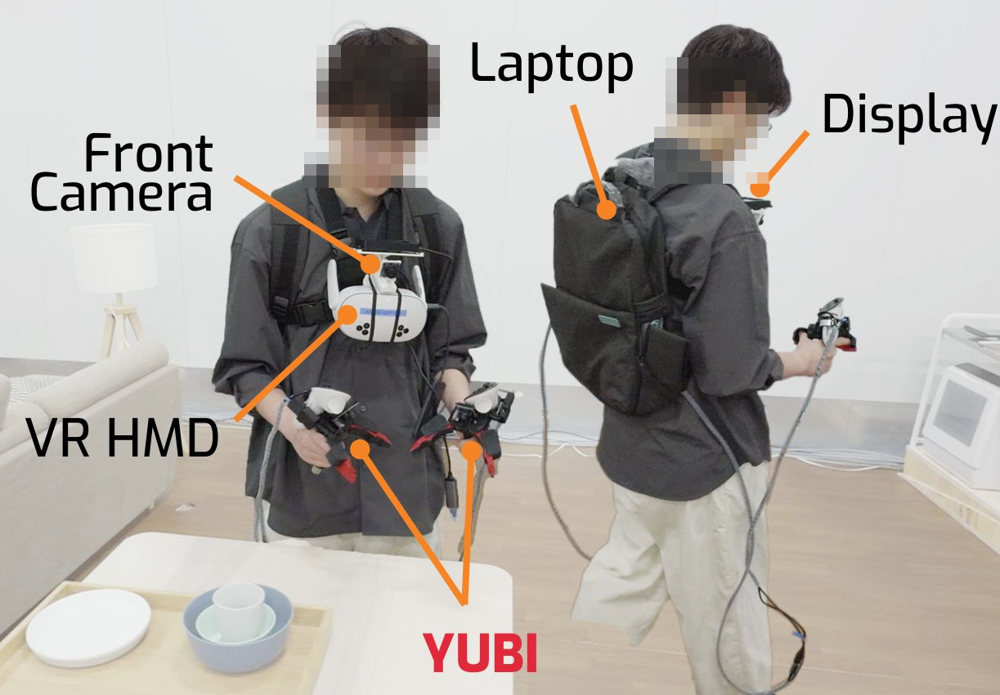

# YUBI - Yielding Universal Bidigital Interface

### Open Source Hardware for Dexterous Manipulation

<p align="center">
  <a href="https://global.toyota/en/mobility/frontier-research/" target="_blank">
    
  </a>
</p>

<p align="center">
  
</p>

**YUBI** is a finger-driven dexterous manipulation system developed by Frontier Research Center, Toyota Motor Corporation.

## Part Overview

<p align="center">
  
</p>

- **YUBI Glove** — A wearable device for collecting finger motion data during teleoperation.
- **YUBI Gripper** — A robot-mounted gripper actuated by DYNAMIXEL servos for dexterous manipulation.
- **Stationary data collection desk** — A desk-mounted rig for data collection.
- **Portable data collection rig** — A wearable rig for portable data collection.

<p align="center">
  
  &nbsp;&nbsp;
  
</p>

## Repository Structure

```
.
├── STEP/
│   ├── glove/       # YUBI Glove (teleoperation device) STEP files
│   ├── gripper/     # YUBI Gripper (robot-mounted, DYNAMIXEL) STEP files
│   └── portable/    # Portable data collection rig STEP files
├── STL/
│   ├── glove/                  # YUBI Glove STL files (for 3D printing)
│   ├── gripper/                # YUBI Gripper STL files (for 3D printing)
│   ├── portable/               # Portable data collection rig STL files
│   ├── stationary/             # Stationary data collection desk STL files
│   └── flange/                 # Flange STL files
├── docs/
│   ├── BOM/                    # Bill of Materials (CSV)
│   └── AssemblyInstruction/    # Assembly guides (PDF)
└── media/                      # Images for documentation
```

## Getting Started

1. Check the [Bill of Materials](docs/BOM/) to source the required components.
2. 3D print parts using files in the [STL](STL/) directory.
3. Follow the [Assembly Instructions](docs/AssemblyInstruction/) to build the hardware.

## Related Repository

- [yubi-sw](https://github.com/airoa-org/yubi-sw) — Software (control, teleoperation)

## Contributors

| Name | Affiliation | Role |
|------|-------------|------|
| Yoshihiro Okumatsu | Frontier Research Center, Toyota Motor Corporation | Project Lead |
| Daiki Fukunaga | Frontier Research Center, Toyota Motor Corporation | Mechanical Design |
| Jumpei Arima | Frontier Research Center, Toyota Motor Corporation | Concept Design |
| Yuki Noguchi | Frontier Research Center, Toyota Motor Corporation | Concept Design |
| Makoto Sugiura| AI Robot Association | Data Collection Rig Design |
| Takehiko Ohkawa| AI Robot Association | Data Collection Concept Design |
| Masayoshi Tsuchinaga | Frontier Research Center, Toyota Motor Corporation | Core Maintainer |
| Yusuke Mizuoka | Frontier Research Center, Toyota Motor Corporation | Maintainer |

## License

This project is licensed under the [CERN Open Hardware Licence Version 2 - Weakly Reciprocal (CERN-OHL-W v2)](LICENSE).

Copyright 2026 Toyota Motor Corporation
